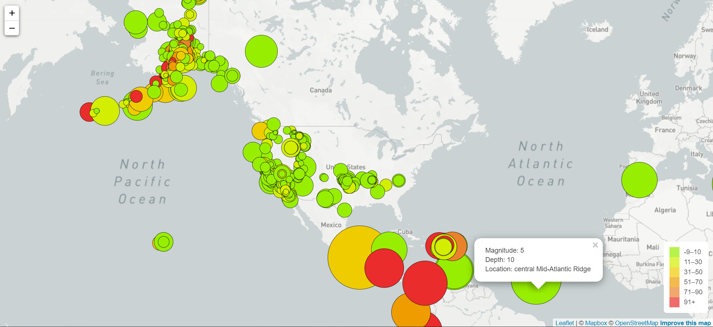
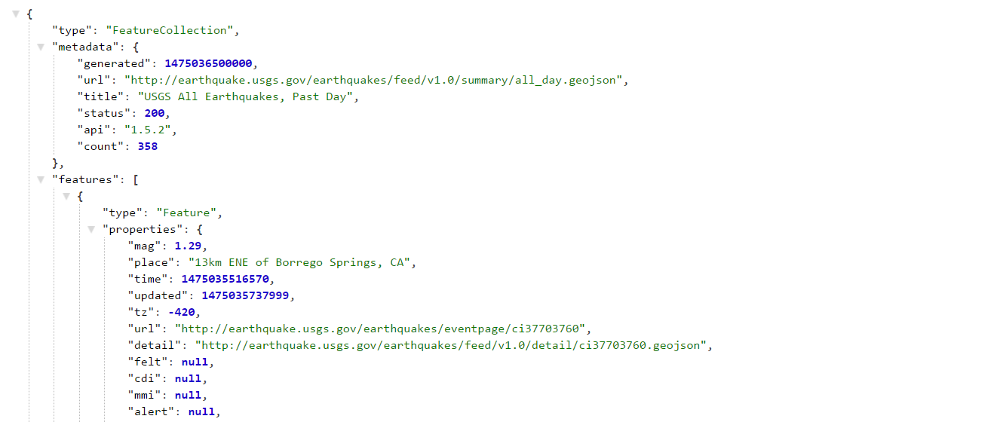

# Visualizing Data with Leaflet

The task was to build a new set of tools that will allow them visualize their earthquake data. They collect a massive amount of data from all over the world each day, but they lack a meaningful way of displaying it. Their hope is that being able to visualize their data will allow them to better educate the public and other government organizations (and hopefully secure more funding..) on issues facing our planet.

**Start**
* Create a new repository for this project called leaflet-challenge. Do not add this homework to an existing repository.

* Clone the new repository to your computer.

* Inside your local git repository, create a directory for the Leaflet challenge. Use the folder names to correspond to the challenges: Leaflet-Step-1 

* This homeworks utilizes both html and Javascript so be sure to add all the necessary files. These will be the main files to run for analysis.

* Push the above changes to GitHub or GitLab.

**Level 1 Basic Visualization**

**Get Data**

**Import & Visualize the Data**

* Create a map using Leaflet that plots all of the earthquakes from your data set based on their longitude and latitude.

* Your data markers should reflect the magnitude of the earthquake by their size and and depth of the earth quake by color. Earthquakes with higher magnitudes should appear larger and earthquakes with greater depth should appear darker in color.

* Include popups that provide additional information about the earthquake when a marker is clicked.

* Create a legend that will provide context for map data.

